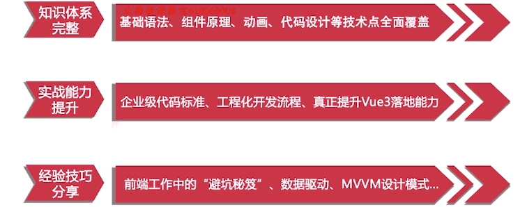
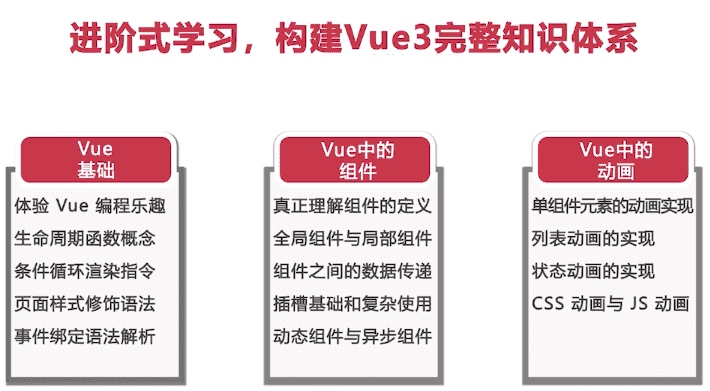
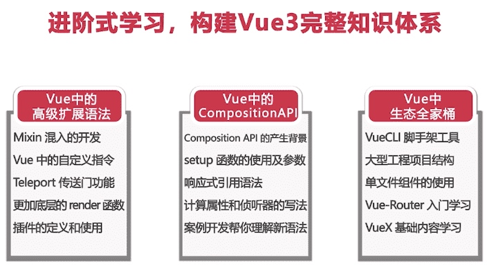
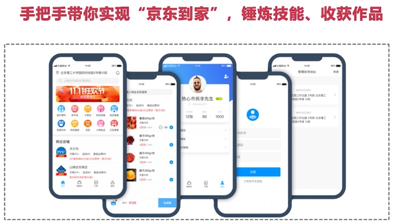
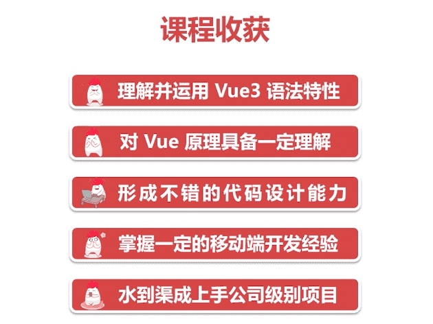

# 第1章 Vue 语法初探

> 本章中，将会通过编写实际例子，带你对Vue的语法有个粗浅的认知，让大家结合例子，有一些自己的疑问，从而带着问题继续学习，以便于更好的理解和掌握后面的知识点。
##  1-1 课前须知，这里有你需要了解的一切 (04:34)


<!--  -->


### 知识储备

* html
* css
* JavaScript
* node
* npm
* webpack

### 课程分为**基础**和**实战**两个部分

<!--  -->


<!--  -->


<!--  -->


### 学完课程收获

<!--  -->


* 理解并运用vue3语法特性
* 对vue原理具备一定理解
* 形成不错的代码设计能力
* 掌握一定的移动端开发经验
* 水到渠成上手公司级别项目


## 1-2 初学编写 HelloWorld 和 Counter (14:41)


### vue cdn地址

> https://unpkg.com/vue@next


* 案例1 hello world

```hmtl
<div id="root"></div>
<script>
    // Vue.createApp 创建vue实例
    Vue.createApp({
        template: '<div>hello world!</div>'
    }).mount('#root')
</script>
```


* 案例2 计时器

```hmtl
<div id="root"></div>
<script>
    // Vue.createApp 创建vue实例
    Vue.createApp({
        data(){
            return {
                content: 1
            }
        },
        // 页面加载完成执行的函数
        mounted(){
            setInterval(()=>{
                this.content += 1
            },1000)
        },
        template: '<div>{{content}}</div>'
    }).mount('#root')
</script>
```


## 1-3 编写字符串反转和内容隐藏小功能 (09:32)

* 案例1 字符串反转

```html
<div id="root"></div>
<script>
    // Vue.createApp 创建vue实例
    Vue.createApp({
        data(){
            return {
                content: "hello world"
            }
        },
        methods:{
            handleBtnClick(){
                const newcontent = this.content.split("").reverse().join("");
                this.content = newcontent
            }
        },
        template: `
        <div>
            {{content}}
            <button v-on:click="handleBtnClick">反转</button>
        </div>
        `
    }).mount('#root')
</script>
```

* 案例2 显示\隐藏


```html
<div id="root"></div>
<script>
    // Vue.createApp 创建vue实例
    Vue.createApp({
        data(){
            return {
                show: true
            }
        },
        methods:{
            handleBtnClick(){
                this.show = !this.show
            }
        },
        template: `
        <div>
            <span v-if="show">hello world</span>
            <button v-on:click="handleBtnClick">显示/隐藏</button>
        </div>
        `
    }).mount('#root')
</script>
```


##  1-4 编写TodoList 小功能，了解循环和双向绑定 (11:18)


```html
<div id="root"></div>
<script>
    // Vue.createApp 创建vue实例
    Vue.createApp({
        data(){
            return {
                inputValue: "",
                list:[]
            }
        },
        methods:{
            handleAddItem(){
                this.list.push(this.inputValue);
                this.inputValue = ""
            }
        },
        template: `
        <div>
            <input type="text" v-model="inputValue">
            <button v-on:click="handleAddItem">提交</button>
            <ul>
                <li v-for="(item,index) in list">{{item}}{{index}}</li>
            </ul>
        </div>
        `
    }).mount('#root')
</script>
```


##  1-5 组件概念初探，对 TodoList 进行组件代码拆分 (16:47)

> v-bind指令
> 组件化
> 数据传递


```html
<div id="root"></div>
<script>
// Vue.createApp 创建vue实例
const app = Vue.createApp({
    data(){
        return {
            inputValue: "",
            list:[]
        }
    },
    methods:{
        handleAddItem(){
            this.list.push(this.inputValue);
            this.inputValue = ""
        }
    },
    template: `
    <div>
        <input type="text" v-model="inputValue">
        <button v-on:click="handleAddItem" :title="inputValue">提交</button>
        <ul>
            <todo-item 
                v-for="(item,index) in list"
                v-bind:content="item"
                v-bind:index="index"
            ></todo-item>
        </ul>
    </div>
    `
})
app.component('todo-item',{
    props:['content','index'],
    template: '<li>{{index}}---{{content}}</li>'
})
app.mount('#root')
</script>
```